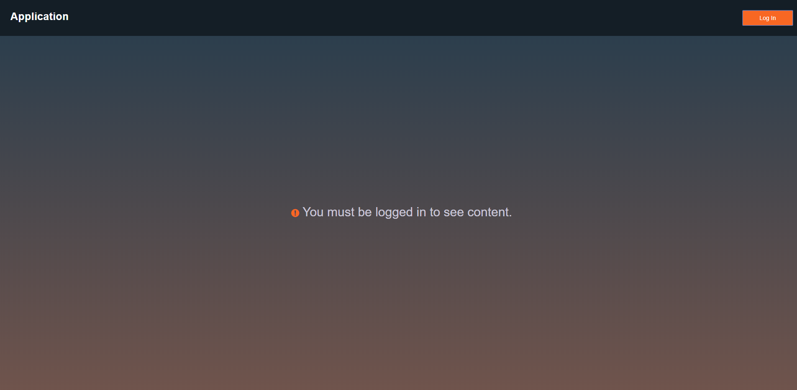
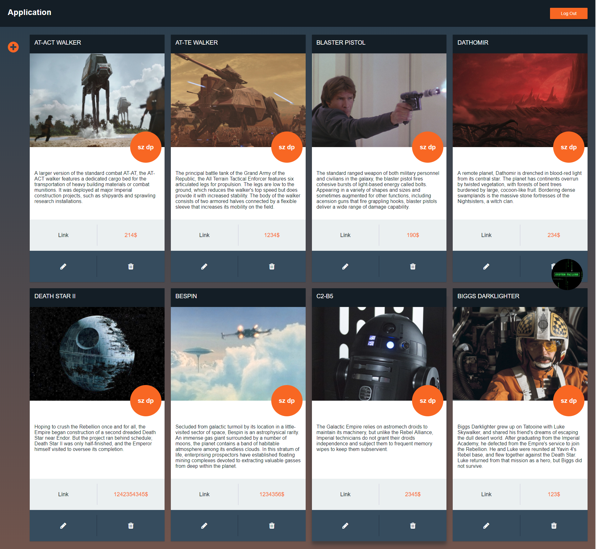
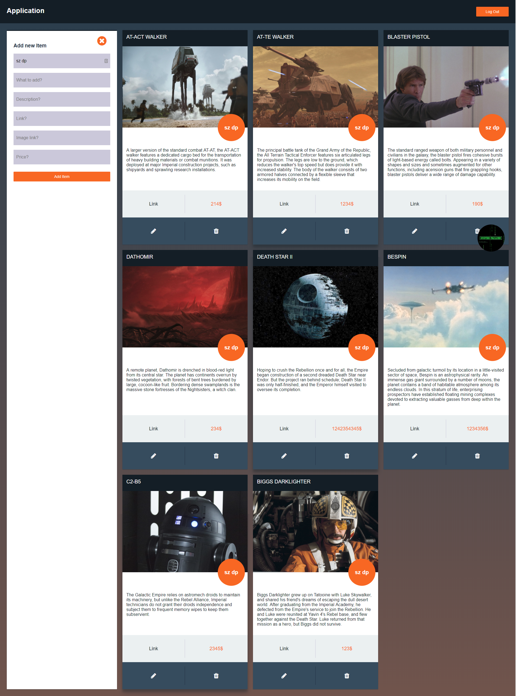

# React Firebase Linker
[Visit App](https://react-data-dd905.firebaseapp.com)

This is React one page demo app for saving various shopping links. React app on Front End use Firebase Backend for authentication and database. App cover all CRUD operations with persistent data on firebase.

## Getting it
Run `git clone https://github.com/drejcreative/react-firebase-linker.git` in terminal.

then runt `yarn install` to install all dependencies.

## Development server
Run `npm start` for a dev server.

## Build
Run `npm build-js` to build the project. The build artifacts will be stored in the `dist/` directory. Use the `-prod` flag for a production build.

This project was bootstrapped with [Create React App](https://github.com/facebookincubator/create-react-app).
